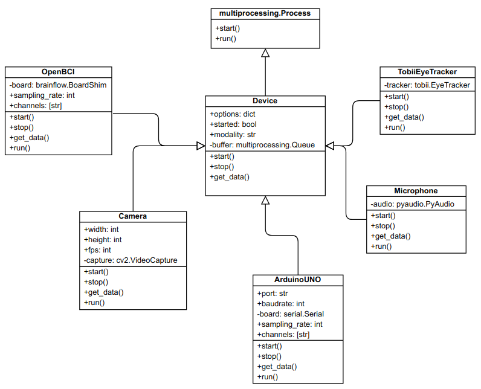

# Multimodal recorder

Приложение является результатом выполнения магистерской диссертации в университете ИТМО.

[Текст диплома](https://disk.yandex.ru/i/POPfbK-JqIjZ3A) с подробным описанием предметной области и деталями реализации.

## Функционал приложения

Приложение обладает широким функционалом (скриншоты и видео по ссылкам в тексте):

- [ведение научных исследований](https://disk.yandex.ru/i/AHoLY57GGcAkqQ): создание и хранение данных об испытуемых и
  используемых устройствах, а также сохранение записей, полученных в ходе экспериментов и наблюдений;
- одновременная запись и мониторинг физиологических данных разных модальностей с помощью различных интерфейсов. На
  данный момент приложение может работать с такими устройствами, как
  OpenBCI, [Arduino UNO](https://disk.yandex.ru/i/U574QPAsepbyLA),
  [Tobii EyeTracker](https://disk.yandex.ru/i/JmByLY2qhB0YLA), а также видеокамера и микрофон;
- [автоматическая постобработка](https://disk.yandex.ru/i/AJAPT7C8PVq45w) записанных данных с возможностью настройки
  пайплайна обработки через интерфейс приложения. _В примере демонстрируется первичная обработка сигнала ЭКГ,
  записанного с помощью устройства OpenBCI: 1) сигнал отзеркаливается относительно оси X; 2) значения масштабируются от
  0 до 255; 3) сигнал ЭКГ переводится в кардиоинтервалы; полученные данные записываются в новый файл)_;
- [автоматический запуск Jupyter Notebook](https://disk.yandex.ru/i/lE47a3jHCtvpbg) по подготовленному шаблону для ранее
  записанных данных ;
- [встройка фреймов с экспериментами](https://disk.yandex.ru/i/p9m6glhlnvtbwg) в основное приложение и передача и запись
  событий, возникающих в ходе эксперимента. _В примере встроен фрейм, в котором испытуемому предлагается выбрать эмоцию,
  возникающую при просмотре ряда коротких видео. Выбор пользователя и временная отметка отправляются на сервер и
  сохраняются_.

## Архитектура приложения

Приложение является клиент-серверным, но может быть запущено только локально, т.к. считывает данные с COM- и
USB-портов,
а также взаимодействует с файловой системой.

### Backend

Backend часть является REST API, реализованным с помощью фреймворка Flask. Данные хранятся в MongoDB и файловой системе.
Для передачи данных с устройств (нейро-интерфейсов) в браузер используется SSE.

В приложении повсеместно используются принципы параллельного программирования:

- генераторы для для передачи данных в формате SSE;
- многопоточность (DeviceManager и RecordManager);
- мультипроцессорность - подключение к каждому устройству устанавливается в отдельном процессе.

### Frontend

Frontend-часть реализована с применением фреймворка Nuxt.JS. Для визуализации данных с устройств используется библиотека
Plotly.

Важной особенностью клиентской части является синхронизация состояния приложения между несколькими открытыми вкладками
(нельзя допустить, чтобы при начатой записи в одной вкладке в другой вкладке эта возможность осталась активной).

Также на страницу записи может быть встроен любой фрейм с экспериментом, который может общаться с приложением c помощью
метода postMessage.
